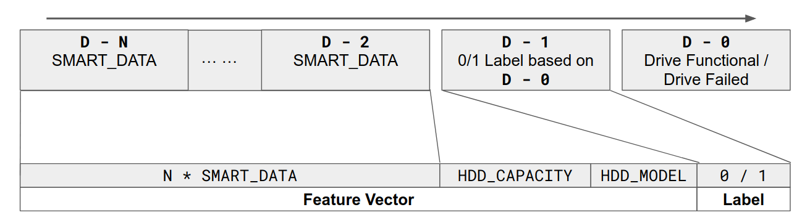
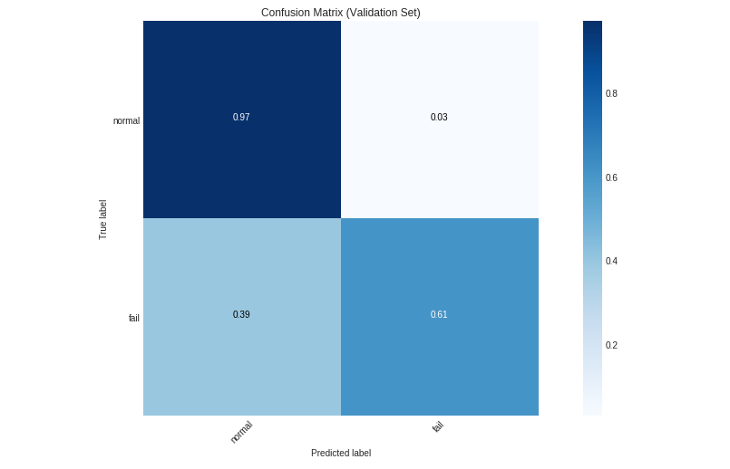

# Predictive HDD Failure

This is an example project meant to demonstrate how RAPIDS can be used to speed up the development and training of machine learning models that use frameworks such as XGBoost. We use the [Backblaze](https://www.backblaze.com/) HDD (hard disk drive) data dataset and XGBoost to create a model that can predict (two days in advance) HDD failure using past `n` days record of [SMART](https://en.wikipedia.org/wiki/S.M.A.R.T.) data. To find out more about the dataset, please visit the [dataset webpage](https://www.backblaze.com/b2/hard-drive-test-data.html).

We have two main categories of data in our processed dataset:

* "normal": `n` days worth of SMART data for a HDD functioning normally two days later
* "failure": `n` days worth of SMART data for a HDD which fails two days later

Both categories also include the HDD model and capacity as additional features. The feature vector used by XGBoost for the classification is shown in the diagram below:



## Results

We obtain reasonable results on the evaluation set, consisting of 4208 cases of "normal" drives and 319 cases of "failure" drives. The evaluation data is dated from **October to December 2018**, and takes place directly after the training set which contains data from **January 2015 to September 2018**. We achieve **61% recall** in correctly predicting drives that are about to fail in the evaluation set with `n=7` This means that:

* 39% false negative (drive is going to fail but we predict normal operation)
* 3% false positive (drive is normal but we predict failure)



With hyper-parameter tuning and feature engineering, it is likely we can do better.

By using [RAPIDS](https://rapids.ai/) components, namely [cuDF](https://github.com/rapidsai/cudf) and the GPU-accelerated version of XGBoost, we achieve about 17x speedup over doing everything on a high-end Intel Xeon CPU.

| Processor                       | Time Taken      |
| ------------------------------- | --------------- |
| Intel Xeon E5-2698 v4 (20C/40T) | 29.9 seconds    |
| NVIDIA Tesla V100 (16GB PCIE)   | 1.8 seconds     |
| **Overall speedup**             | **17x**         |

Results were averaged across three runs, measured from the `nvaitc/ai-lab:0.4` container. The test was performed using an [NVIDIA DGX Station](https://www.nvidia.com/en-sg/data-center/dgx-station/) running DGX OS 4 (Ubuntu 18.04) and the latest 410.79 driver.

## Running the Code

**Notebooks**

You need to download the `train.csv` and `eval.csv` files in order to run the main `drive_data_xgboost` notebook. Please view the next section for more details.

* `drive_data_xgboost` contains the model training with some elaboration and evaluation
* `processing_okfail` generates the combined train/eval CSV files from the preprocessed data
* `preprocess_data` performs data cleaning and dropping of some columns from the raw data from BackBlaze

To run `drive_data_xgboost`, you will need to have cuDF and RAPIDS installed. The easiest way to ensure this is to use the `nvaitc/ai-lab` container.

```
# download repository
mkdir work
cd work
git clone https://github.com/NVAITC/predictive-hdd-failure
cd predictive-hdd-failure

# download processed data
wget https://s3-ap-southeast-1.amazonaws.com/deeplearning-mat/hdd_test_data/train.csv
wget https://s3-ap-southeast-1.amazonaws.com/deeplearning-mat/hdd_test_data/test.csv

# download and run container
docker pull nvaitc/ai-lab:rapids
nvidia-docker run --rm -p 8888:8888 -v /home/$USER/work/predictive-hdd-failure:/home/jovyan nvaitc/ai-lab:rapids
```

Please note that you will require the nvidia-driver>=396 and nvidia-docker2 runtime on the host machine. [Additional Instructions](https://github.com/NVAITC/ai-lab/blob/master/INSTRUCTIONS.md)

**Processed Data**

The training set `train.csv` consists of all the drive failures from **Jan 2015 to Sep 2018**, and a subset (about 40 each day) of the data for working drives, sampled at intervals (effectively random since drive counts change every day).

The evaluation set `eval.csv` consists of all the drive failures in **Oct - Dec 2018**, and a subset (about 100 each day) of the data for working drives.

* Training Set: https://s3-ap-southeast-1.amazonaws.com/deeplearning-iap-material/hdd_test_data/train.csv
* Evaluation Set: https://s3-ap-southeast-1.amazonaws.com/deeplearning-iap-material/hdd_test_data/eval.csv
